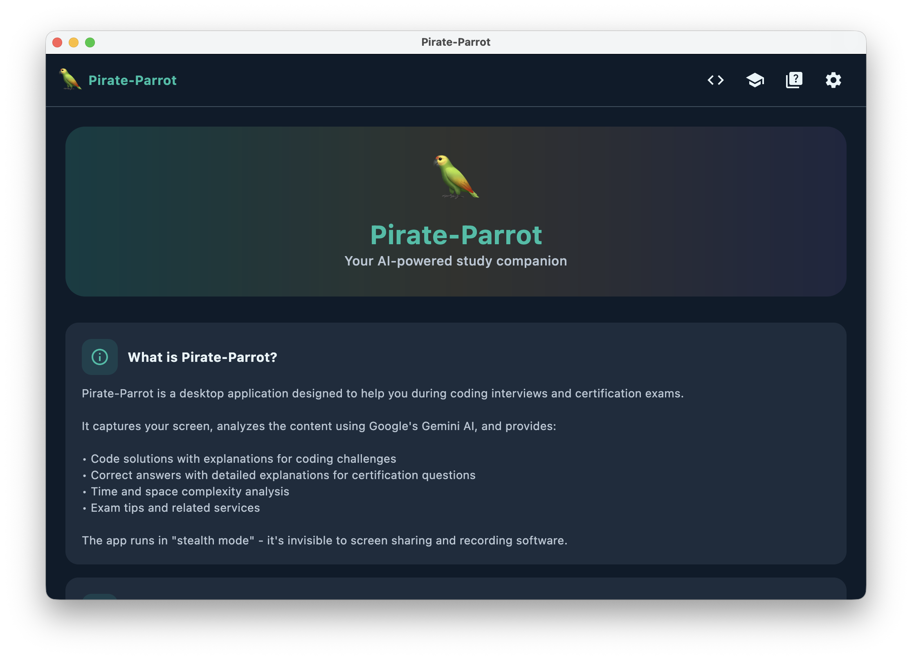
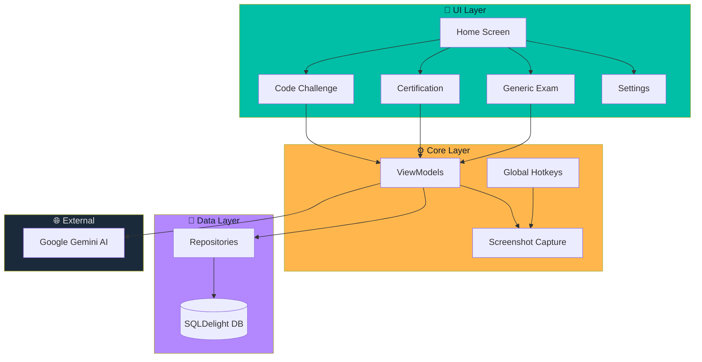

# 🦜 Pirate-Parrot

> Your AI-powered study companion for coding interviews and certification exams.

## Welcome

Pirate-Parrot is a cross-platform desktop application that captures your screen, analyzes content using Google's Gemini AI, and provides intelligent solutions and answers in real-time.



**Key Highlights:**

- 🖥️ **Code Challenge Mode** - Get complete solutions for coding problems
- 📜 **AWS Certification Mode** - Ace your AWS certification exams
- 📝 **Generic Exam Mode** - Support for ENEM, Vestibular, Concursos
- 🔒 **Stealth Mode** - Invisible to screen sharing and recording
- ⌨️ **Global Hotkeys** - Quick capture from anywhere

## Quick Start

```bash
# Clone and run
git clone https://github.com/ericomonteiro/pirate-parrot-ai.git
cd pirate-parrot-ai
./gradlew :composeApp:run
```

Then configure your [Gemini API Key](getting-started/configuration.md) in Settings.

## Architecture Overview



## Tech Stack

| Category | Technology |
|----------|------------|
| **Language** | Kotlin 2.2.20 |
| **UI Framework** | Compose Multiplatform 1.9.1 |
| **AI Provider** | Google Gemini API |
| **Networking** | Ktor 2.3.7 |
| **Database** | SQLDelight 2.0.1 |
| **DI** | Koin 3.5.3 |

## Documentation Sections

- **[Getting Started](getting-started/)** - Installation, configuration, and first steps
- **[Features](features/)** - Detailed feature documentation
- **[Architecture](architecture/)** - Technical architecture and design
- **[API Reference](api/)** - API documentation and integration
- **[Contributing](contributing.md)** - How to contribute to the project
