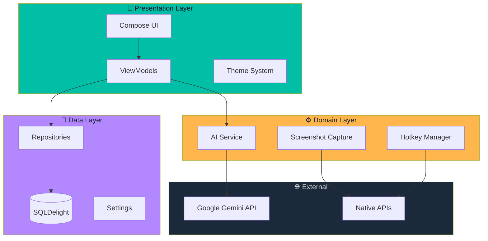
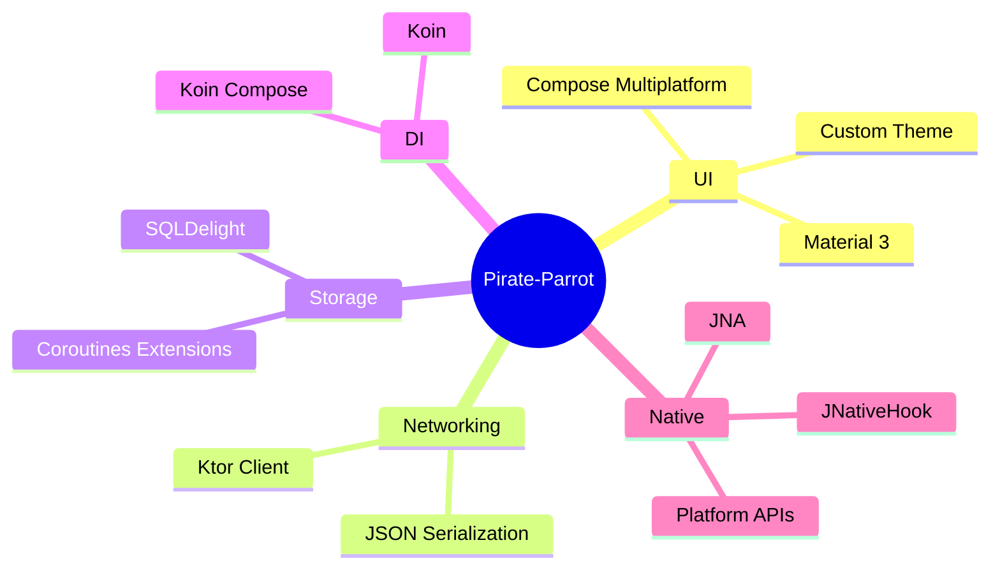
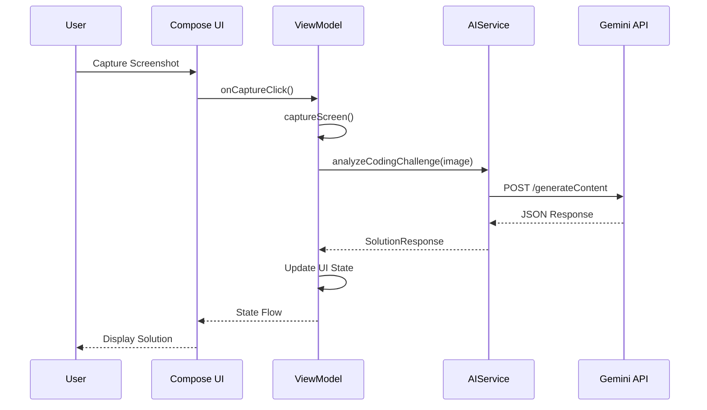
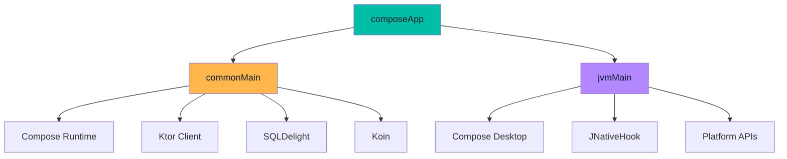

# Architecture Overview

Pirate-Parrot follows a clean architecture pattern with clear separation of concerns.

## High-Level Architecture

## Layer Responsibilities

### Presentation Layer

| Component | Responsibility |
|-----------|---------------|
| **Compose UI** | Render screens and handle user interactions |
| **ViewModels** | Manage UI state and business logic |
| **Theme** | Define colors, typography, and styling |

### Domain Layer

| Component | Responsibility |
|-----------|---------------|
| **AI Service** | Communicate with Gemini API |
| **Screenshot** | Capture screen content |
| **Hotkey Manager** | Handle global keyboard shortcuts |

### Data Layer

| Component | Responsibility |
|-----------|---------------|
| **Repositories** | Abstract data sources |
| **SQLDelight** | Local database storage |
| **Settings** | User preferences management |

## Technology Stack

## Data Flow

## Key Design Decisions

### 1. Compose Multiplatform

Chosen for:
- **Single codebase** for UI across platforms
- **Declarative UI** paradigm
- **Kotlin-first** development
- **Hot reload** support

### 2. Koin for DI

Chosen for:
- **Lightweight** - No code generation
- **Kotlin DSL** - Natural syntax
- **Compose integration** - Easy ViewModel injection

### 3. SQLDelight for Storage

Chosen for:
- **Type-safe SQL** - Compile-time verification
- **Multiplatform** - Works on JVM, Native, JS
- **Coroutines** - Flow-based queries

### 4. Ktor for Networking

Chosen for:
- **Kotlin-native** - Coroutines support
- **Multiplatform** - Same API everywhere
- **Extensible** - Plugin architecture

## Module Dependencies

## Further Reading

- [Project Structure](/architecture/project-structure.md) - Detailed file organization
- [Data Flow](/architecture/data-flow.md) - How data moves through the app
- [AI Integration](/architecture/ai-integration.md) - Gemini API integration details
