# Features Overview

Pirate-Parrot offers three main analysis modes, plus powerful utility features.

## Analysis Modes

```mermaid
graph LR
    subgraph Modes["🎯 Analysis Modes"]
        A[💻 Code Challenge]
        B[📜 Certification]
        C[📝 Generic Exam]
    end
    
    subgraph Output["📤 Output"]
        D[Code + Explanation]
        E[Answer + Reasoning]
        F[Answer + Study Tips]
    end
    
    A --> D
    B --> E
    C --> F
    
    style A fill:#00BFA6,color:#0D1B2A
    style B fill:#FFB74D,color:#0D1B2A
    style C fill:#B388FF,color:#0D1B2A
```

### [💻 Code Challenge Mode](/features/code-challenge.md)

Solve coding problems from platforms like LeetCode, HackerRank, and CodeSignal.

**Features:**
- Complete code solutions in your preferred language
- Time and space complexity analysis
- Step-by-step explanations
- Syntax-highlighted code editor

### [📜 Certification Mode](/features/certification.md)

Prepare for AWS certification exams with AI-powered assistance.

**Supported Certifications:**
- AWS Cloud Practitioner
- AWS Solutions Architect (Associate & Professional)
- AWS Developer Associate
- AWS SysOps Administrator
- AWS DevOps Engineer Professional

### [📝 Generic Exam Mode](/features/generic-exam.md)

Support for Brazilian exams and general assessments.

**Supported Exams:**
- ENEM
- Vestibular
- Concursos Públicos
- OAB
- ENADE

---

## Utility Features

### [📐 Capture Region](/features/capture-region.md)

Define a specific screen area to capture instead of the entire screen.

**Benefits:**
- Capture only the relevant content
- Faster AI processing with smaller images
- Avoid capturing sensitive information
- Works with all analysis modes

### [🔒 Stealth Mode](/features/stealth-mode.md)

Hide the application from screen capture and recording software.

### [⌨️ Global Hotkeys](/features/hotkeys.md)

Control the app from anywhere with keyboard shortcuts.

| Action | macOS | Windows |
|--------|-------|---------|
| Capture | <kbd>Cmd</kbd>+<kbd>Shift</kbd>+<kbd>Opt</kbd>+<kbd>S</kbd> | <kbd>Ctrl</kbd>+<kbd>Shift</kbd>+<kbd>Alt</kbd>+<kbd>S</kbd> |
| Toggle Stealth | <kbd>Cmd</kbd>+<kbd>Shift</kbd>+<kbd>Opt</kbd>+<kbd>B</kbd> | <kbd>Ctrl</kbd>+<kbd>Shift</kbd>+<kbd>Alt</kbd>+<kbd>B</kbd> |

---

## Feature Comparison

| Feature | Code Challenge | Certification | Generic Exam |
|---------|---------------|---------------|--------------|
| Screenshot Analysis | ✅ | ✅ | ✅ |
| Code Generation | ✅ | ❌ | ❌ |
| Answer Explanation | ✅ | ✅ | ✅ |
| Complexity Analysis | ✅ | ❌ | ❌ |
| Wrong Answer Reasoning | ❌ | ✅ | ✅ |
| Related Topics | ❌ | ✅ (AWS Services) | ✅ (Subject/Topic) |
| Multi-language Support | Code languages | Question language | Question language |
