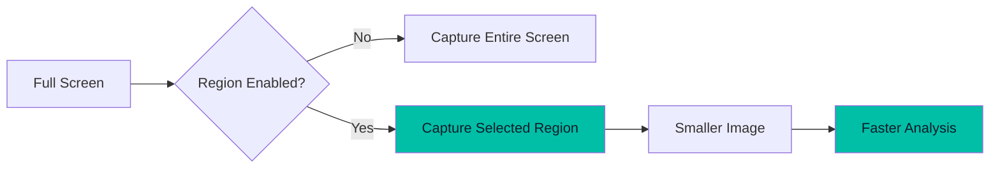
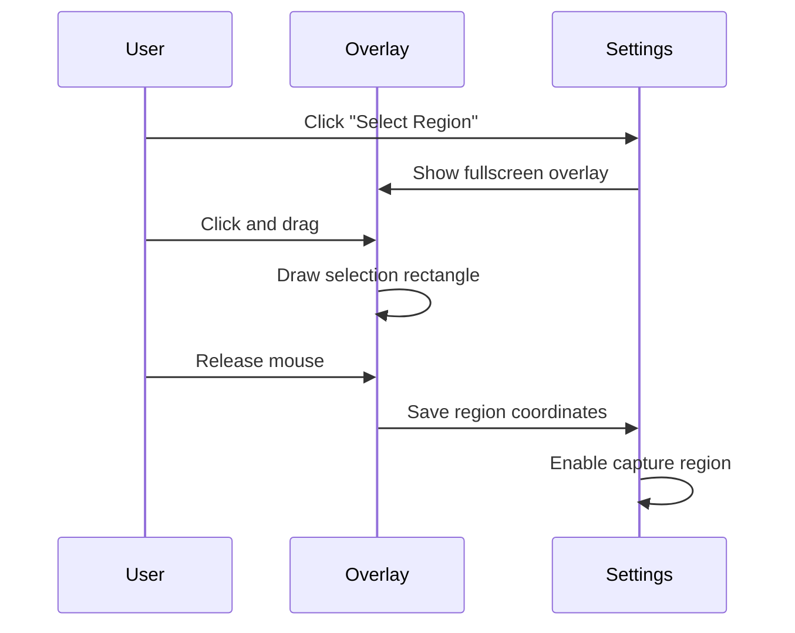

# Capture Region

Define a specific screen area to capture instead of the entire screen.

## Overview

The Capture Region feature allows you to select a specific area of your screen for screenshot capture. This is useful when you want to focus on a particular window or section without capturing your entire desktop.



## Benefits

| Benefit | Description |
|---------|-------------|
| **Focused Capture** | Only capture the relevant content |
| **Faster Processing** | Smaller images are processed faster by AI |
| **Less Noise** | Avoid capturing irrelevant UI elements |
| **Privacy** | Don't accidentally capture sensitive information |

## How to Use

### 1. Open Settings

Navigate to **Settings** from the home screen or any analysis screen.

### 2. Find Capture Region Section

Scroll down to the **Capture Region** section.


### 3. Select a Region

Click the **"Select Region"** button. A fullscreen overlay will appear.

### 4. Draw the Region

- **Click and drag** to draw a rectangle around the area you want to capture
- The selected area will be highlighted with a teal border
- The dimensions (width × height) are displayed above the selection
- Press **ESC** to cancel



### 5. Manage the Region

Once a region is selected:

- **Toggle Switch**: Enable/disable the region without losing the coordinates
- **Clear Button**: Remove the saved region entirely
- **Select Region**: Change the region to a new area

## Configuration

### Settings Keys

| Key | Type | Description |
|-----|------|-------------|
| `capture_region_enabled` | `Boolean` | Whether to use custom region |
| `capture_region_x` | `Int` | X coordinate of top-left corner |
| `capture_region_y` | `Int` | Y coordinate of top-left corner |
| `capture_region_width` | `Int` | Width of the region in pixels |
| `capture_region_height` | `Int` | Height of the region in pixels |

### Data Model

```kotlin
data class CaptureRegion(
    val x: Int,
    val y: Int,
    val width: Int,
    val height: Int
) {
    fun isValid(): Boolean = width > 0 && height > 0
}
```

## Technical Details

### Region Selection Window

The region selector uses a native AWT/Swing overlay window:

```kotlin
class RegionSelectorWindow(
    private val onRegionSelected: (CaptureRegion) -> Unit,
    private val onCancelled: () -> Unit
)
```

Features:
- **Fullscreen transparent overlay** covers the entire screen
- **Crosshair cursor** for precise selection
- **Real-time preview** shows the selection as you drag
- **Dimension display** shows width × height
- **Dashed border** with corner markers for visibility
- **ESC key** to cancel selection

### Screenshot Capture

When capturing with a region:

```kotlin
actual suspend fun captureScreenshot(region: CaptureRegion?): Result<String> {
    val screenRect = if (region != null && region.isValid()) {
        Rectangle(region.x, region.y, region.width, region.height)
    } else {
        Rectangle(Toolkit.getDefaultToolkit().screenSize)
    }
    
    val screenshot = Robot().createScreenCapture(screenRect)
    // ... convert to base64
}
```

### Persistence

The region is automatically:
- **Saved** when you select a new region
- **Loaded** when the application starts
- **Applied** to all capture operations (Code Challenge, Certification, Generic Exam)

## Best Practices

### 1. Select the Right Size

Choose a region that includes all relevant content but excludes unnecessary elements:

```
✅ Good: Just the code editor or question area
❌ Bad: Entire screen with taskbar and other windows
```

### 2. Account for Dynamic Content

If the content you're capturing changes position, you may need to update the region.

### 3. Test Your Region

After selecting a region, do a test capture to ensure it captures what you expect.

### 4. Use Full Screen When Needed

For complex layouts or when content position varies, disable the region to capture the full screen.

## Troubleshooting

### Region Not Capturing Expected Area

**Cause:** The region was set on a different monitor or resolution.

**Solution:** Clear the region and select a new one.

### Selection Too Small

**Cause:** The minimum selection size is 10×10 pixels.

**Solution:** Draw a larger selection area.

### Region Appears Offset

**Cause:** Display scaling or multiple monitors can affect coordinates.

**Solution:** 
1. Clear the existing region
2. Ensure the target content is on your primary monitor
3. Select a new region

## Integration with Other Features

The capture region works seamlessly with:

- **[Code Challenge Mode](/features/code-challenge.md)**: Capture just the problem statement
- **[Certification Mode](/features/certification.md)**: Focus on the question and answers
- **[Generic Exam Mode](/features/generic-exam.md)**: Capture specific exam questions
- **[Global Hotkeys](/features/hotkeys.md)**: Hotkey capture uses the configured region
- **[Stealth Mode](/features/stealth-mode.md)**: Region capture respects stealth settings
