# Certification Mode

Prepare for AWS certification exams with AI-powered question analysis.


## Overview

Certification Mode helps you study for AWS certifications by analyzing exam questions and providing detailed explanations for correct and incorrect answers.

```mermaid
flowchart TD
    A[📸 Capture Question] --> B[🔍 AI Analysis]
    B --> C[✅ Identify Correct Answer]
    C --> D[📖 Explain Why Correct]
    D --> E[❌ Explain Why Others Wrong]
    E --> F[🔗 List Related Services]
    F --> G[💡 Exam Tips]
    
    style A fill:#FFB74D,color:#0D1B2A
    style G fill:#FFB74D,color:#0D1B2A
```



## Supported Certifications

| Certification | Level | Code |
|--------------|-------|------|
| AWS Cloud Practitioner | Foundational | CLF-C02 |
| AWS Solutions Architect Associate | Associate | SAA-C03 |
| AWS Developer Associate | Associate | DVA-C02 |
| AWS SysOps Administrator | Associate | SOA-C02 |
| AWS Solutions Architect Professional | Professional | SAP-C02 |
| AWS DevOps Engineer Professional | Professional | DOP-C02 |

## How It Works

### 1. Select Certification Type

Choose your certification from the dropdown to help the AI provide more relevant context.

### 2. Capture the Question

Press <kbd>Cmd</kbd>+<kbd>Shift</kbd>+<kbd>Opt</kbd>+<kbd>S</kbd> or click "Capture Screenshot".

> **Important:** Capture the complete question including:
> - Question text
> - All answer options (A, B, C, D, etc.)
> - Any diagrams or tables

### 3. Review Analysis

The response includes comprehensive analysis:

```
┌─────────────────────────────────────────┐
│ ❓ QUESTION SUMMARY                     │
│                                         │
│ Which AWS service should be used to     │
│ store session data for a web app with   │
│ low latency requirements?               │
├─────────────────────────────────────────┤
│ ✅ CORRECT ANSWER                       │
│                                         │
│ B. Amazon ElastiCache                   │
├─────────────────────────────────────────┤
│ 📖 EXPLANATION                          │
│                                         │
│ ElastiCache is an in-memory caching     │
│ service that provides sub-millisecond   │
│ latency. It's ideal for session storage │
│ because...                              │
├─────────────────────────────────────────┤
│ ❌ WHY OTHERS ARE WRONG                 │
│                                         │
│ A. Amazon RDS - Relational database,    │
│    higher latency than in-memory cache  │
│                                         │
│ C. Amazon S3 - Object storage, not      │
│    designed for low-latency access      │
│                                         │
│ D. Amazon EBS - Block storage for EC2,  │
│    not a caching solution               │
├─────────────────────────────────────────┤
│ 🔗 RELATED SERVICES                     │
│                                         │
│ ElastiCache, Redis, Memcached, DynamoDB │
├─────────────────────────────────────────┤
│ 💡 EXAM TIP                             │
│                                         │
│ When you see "low latency" + "session"  │
│ think ElastiCache. For "serverless"     │
│ session storage, consider DynamoDB.     │
└─────────────────────────────────────────┘
```

## Response Format

```json
{
  "answers": [
    {
      "questionNumber": 1,
      "questionSummary": "Brief summary of the question",
      "correctAnswer": "B. Amazon ElastiCache",
      "explanation": "Detailed explanation...",
      "incorrectAnswersExplanation": "Why A, C, D are wrong...",
      "relatedServices": ["ElastiCache", "Redis", "DynamoDB"]
    }
  ],
  "examTips": "General tips for similar questions"
}
```

## Multi-Question Support

The AI can analyze **multiple questions** in a single screenshot:


Each question gets its own detailed analysis with `questionNumber` incrementing.

## Language Detection

The AI automatically detects the question language and responds in the same language:

- 🇺🇸 English
- 🇧🇷 Portuguese
- 🇪🇸 Spanish
- And more...

## Study Tips by Certification

### Cloud Practitioner (CLF-C02)

- Focus on **service categories** (Compute, Storage, Database)
- Understand **pricing models** (On-Demand, Reserved, Spot)
- Know the **Shared Responsibility Model**

### Solutions Architect Associate (SAA-C03)

- Master **high availability** patterns
- Understand **VPC networking**
- Know when to use each **database service**

### Developer Associate (DVA-C02)

- Deep dive into **Lambda, API Gateway, DynamoDB**
- Understand **CI/CD with CodePipeline**
- Know **SDK and CLI** usage patterns

## Best Practices

### For Accurate Results

1. **Clear screenshots** - Ensure text is readable
2. **Complete questions** - Include all options
3. **Select correct certification** - Helps AI provide relevant context

### For Effective Study

1. **Read explanations thoroughly** - Don't just memorize answers
2. **Understand why wrong answers are wrong** - Common exam technique
3. **Note related services** - Build mental connections
4. **Apply exam tips** - Pattern recognition helps

## Troubleshooting

| Issue | Solution |
|-------|----------|
| Wrong answer identified | Ensure complete question is captured |
| Missing explanation | Try recapturing with better quality |
| Wrong language response | AI follows question language |
| Multiple questions merged | Capture one question at a time |
