# Code Challenge Mode

Solve coding problems with AI-powered analysis and complete solutions.


## Overview

Code Challenge Mode is designed for technical interviews and coding practice. It analyzes screenshots of coding problems and provides complete, working solutions.

```mermaid
flowchart TD
    A[📸 Capture Problem] --> B[🔍 AI Analysis]
    B --> C[📝 Extract Requirements]
    C --> D[💡 Generate Solution]
    D --> E[📊 Analyze Complexity]
    E --> F[📤 Display Results]
    
    style A fill:#00BFA6,color:#0D1B2A
    style F fill:#00BFA6,color:#0D1B2A
```



## Supported Platforms

Works with any coding platform that displays problems visually:

- **LeetCode**
- **HackerRank**
- **CodeSignal**
- **Codility**
- **TopCoder**
- **Codeforces**
- **AtCoder**
- **Interview platforms** (CoderPad, HackerEarth, etc.)

## Supported Languages

Select your preferred programming language:

| Language | Extension |
|----------|-----------|
| Kotlin | `.kt` |
| Java | `.java` |
| Python | `.py` |
| JavaScript | `.js` |
| TypeScript | `.ts` |
| Go | `.go` |
| Rust | `.rs` |
| C++ | `.cpp` |
| C# | `.cs` |
| Swift | `.swift` |

## How It Works

### 1. Capture the Problem

Press <kbd>Cmd</kbd>+<kbd>Shift</kbd>+<kbd>Opt</kbd>+<kbd>S</kbd> or click "Capture Screenshot".

> **Tip:** Make sure the entire problem description is visible, including:
> - Problem statement
> - Input/output examples
> - Constraints

### 2. AI Analysis

The Gemini AI:
1. Extracts text from the screenshot
2. Understands the problem requirements
3. Identifies constraints and edge cases
4. Generates an optimal solution

### 3. Review Solution

The response includes:

```
┌─────────────────────────────────────────┐
│ 📝 EXPLANATION                          │
│                                         │
│ This problem asks us to find the        │
│ longest substring without repeating     │
│ characters. We use a sliding window     │
│ approach with a hash set...             │
├─────────────────────────────────────────┤
│ 💻 CODE                                 │
│                                         │
│ fun lengthOfLongestSubstring(           │
│     s: String                           │
│ ): Int {                                │
│     val seen = mutableSetOf<Char>()     │
│     var left = 0                        │
│     var maxLen = 0                      │
│     ...                                 │
│ }                                       │
├─────────────────────────────────────────┤
│ ⏱️ Time Complexity: O(n)                │
│ 💾 Space Complexity: O(min(n, m))       │
└─────────────────────────────────────────┘
```

## Response Format

The AI returns a structured JSON response:

```json
{
  "code": "fun solution(): Int { ... }",
  "explanation": "Brief explanation of the approach",
  "timeComplexity": "O(n)",
  "spaceComplexity": "O(1)"
}
```

## Code Editor Features

The built-in code editor provides:

- **Syntax highlighting** for all supported languages
- **Copy button** to quickly copy code
- **Line numbers** for easy reference
- **Dark theme** matching the app aesthetic

## Best Practices

### For Best Results

1. **Clear screenshots**
   - High resolution
   - Good contrast
   - No overlapping windows

2. **Complete information**
   - Include all examples
   - Show constraints
   - Capture function signature if provided

3. **One problem at a time**
   - Don't capture multiple problems
   - Focus on a single question

### Understanding the Solution

1. Read the **explanation** first
2. Trace through the **code** with an example
3. Verify the **complexity** matches constraints
4. Adapt the solution to your coding style

## Example Workflow


## Troubleshooting

| Issue | Solution |
|-------|----------|
| Code doesn't compile | Check language selection matches expected output |
| Wrong algorithm | Capture more context (constraints, examples) |
| Timeout on submission | Solution may not be optimal; review complexity |
| Missing imports | Add standard library imports manually |

## Tips for Interviews

1. **Don't just copy** - Understand the solution
2. **Explain your approach** - Use the explanation as a guide
3. **Test edge cases** - The AI may miss some
4. **Optimize if needed** - Sometimes a simpler solution is better for interviews
