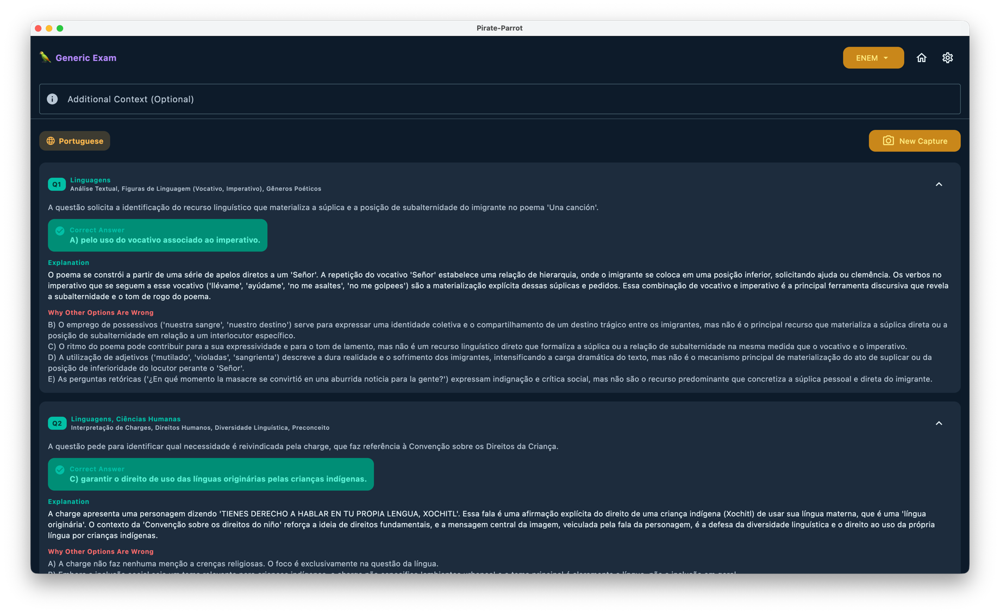
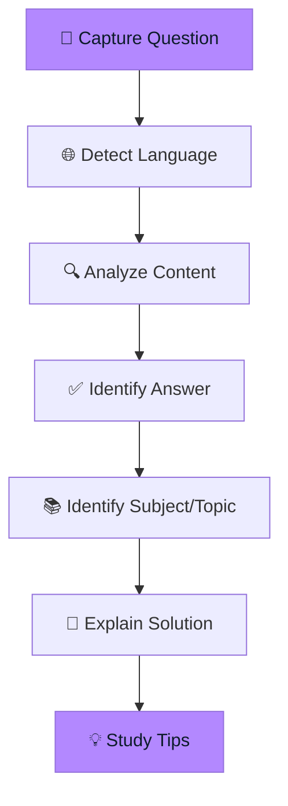
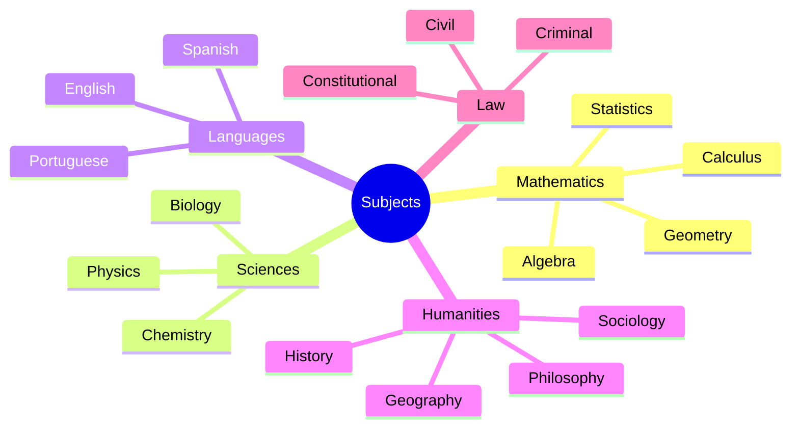

# Generic Exam Mode

Support for Brazilian exams and general assessments with AI-powered analysis.



## Overview

Generic Exam Mode is designed for a variety of standardized tests, particularly Brazilian exams. It provides detailed answers with subject identification and study tips.



## Supported Exam Types

| Exam | Description | Country |
|------|-------------|---------|
| **ENEM** | Exame Nacional do Ensino Médio | 🇧🇷 Brazil |
| **Vestibular** | University entrance exams | 🇧🇷 Brazil |
| **Concurso Público** | Public service exams | 🇧🇷 Brazil |
| **OAB** | Bar Association exam | 🇧🇷 Brazil |
| **ENADE** | Higher education assessment | 🇧🇷 Brazil |
| **Outros** | Other exams and tests | 🌍 Any |

## How It Works

### 1. Select Exam Type

Choose the exam type to help the AI understand the context and format.

### 2. Add Context (Optional)

Provide additional context like:
- Subject area (if known)
- Specific topic
- Year of the exam

### 3. Capture the Question

Press <kbd>Cmd</kbd>+<kbd>Shift</kbd>+<kbd>Opt</kbd>+<kbd>S</kbd> or click "Capture Screenshot".

### 4. Review Analysis

```
┌─────────────────────────────────────────┐
│ 🌐 DETECTED LANGUAGE: Portuguese        │
├─────────────────────────────────────────┤
│ ❓ QUESTION SUMMARY                     │
│                                         │
│ Calculate the area of a triangle with   │
│ base 10cm and height 8cm.               │
├─────────────────────────────────────────┤
│ ✅ CORRECT ANSWER                       │
│                                         │
│ C. 40 cm²                               │
├─────────────────────────────────────────┤
│ 📖 EXPLANATION                          │
│                                         │
│ A área do triângulo é calculada pela    │
│ fórmula: A = (base × altura) / 2        │
│ A = (10 × 8) / 2 = 80 / 2 = 40 cm²     │
├─────────────────────────────────────────┤
│ ❌ WHY OTHERS ARE WRONG                 │
│                                         │
│ A. 80 cm² - Forgot to divide by 2       │
│ B. 20 cm² - Calculation error           │
│ D. 18 cm² - Used wrong formula          │
├─────────────────────────────────────────┤
│ 📚 SUBJECT: Mathematics                 │
│ 📌 TOPIC: Geometry - Area Calculation   │
├─────────────────────────────────────────┤
│ 💡 STUDY TIPS                           │
│                                         │
│ Memorize area formulas for common       │
│ shapes. Remember: triangle = bh/2,      │
│ rectangle = bh, circle = πr²            │
└─────────────────────────────────────────┘
```

## Response Format

```json
{
  "detectedLanguage": "Portuguese",
  "answers": [
    {
      "questionNumber": 1,
      "questionSummary": "Calculate triangle area",
      "correctAnswer": "C. 40 cm²",
      "explanation": "Step-by-step solution...",
      "incorrectAnswersExplanation": "Why others are wrong...",
      "subject": "Mathematics",
      "topic": "Geometry - Area Calculation"
    }
  ],
  "studyTips": "Tips for studying this topic"
}
```

## Subject Coverage

The AI can identify and explain questions from various subjects:



## Language Support

The AI automatically:
1. **Detects** the language of the question
2. **Responds** in the same language
3. **Adapts** explanations to cultural context

Supported languages:
- 🇧🇷 Portuguese (Brazilian)
- 🇺🇸 English
- 🇪🇸 Spanish
- 🇫🇷 French

## ENEM-Specific Features

For ENEM questions, the AI provides:

- **Competency identification** (1-5)
- **Skill mapping** (H1-H30)
- **Interdisciplinary connections**
- **Common ENEM patterns**

## Best Practices

### For Best Results

1. **Capture complete questions**
   - Include all text
   - Include images/graphs if present
   - Include all answer options

2. **Select correct exam type**
   - Helps AI understand format
   - Provides relevant context

3. **Add context when helpful**
   - "This is a physics question about thermodynamics"
   - "ENEM 2023, question 45"

### For Effective Study

1. **Focus on explanations** - Understand the reasoning
2. **Note the subject/topic** - Identify weak areas
3. **Review wrong answers** - Common exam technique
4. **Apply study tips** - Build systematic knowledge

## Troubleshooting

| Issue | Solution |
|-------|----------|
| Wrong language detected | Add context specifying language |
| Subject misidentified | Provide additional context |
| Incomplete explanation | Recapture with better quality |
| Math rendering issues | AI provides text-based formulas |

## Tips by Exam Type

### ENEM

- Focus on **text interpretation**
- Practice **interdisciplinary questions**
- Review **current events** (especially for humanities)

### Vestibular

- Know your **target university's style**
- Practice **time management**
- Focus on **high-weight subjects**

### Concursos

- Study the **specific edital**
- Focus on **Portuguese and reasoning**
- Practice **previous exams**

### OAB

- Master **procedural law**
- Know **constitutional principles**
- Practice **case analysis**
