# Getting Started

Welcome to Pirate-Parrot! This guide will help you get up and running quickly.

## What You'll Need

Before you begin, make sure you have:

- **JDK 21** or later installed
- A **Google Gemini API Key** (free tier available)
- **macOS**, **Windows**, or **Linux** operating system

## Quick Overview

```mermaid
flowchart LR
    A[📥 Install] --> B[⚙️ Configure]
    B --> C[🔑 Add API Key]
    C --> D[🚀 Start Using]
    
    style A fill:#00BFA6,color:#0D1B2A
    style B fill:#FFB74D,color:#0D1B2A
    style C fill:#B388FF,color:#0D1B2A
    style D fill:#00BFA6,color:#0D1B2A
```

## Steps

1. **[Installation](/getting-started/installation.md)** - Download or build the application
2. **[Configuration](/getting-started/configuration.md)** - Set up your API key and preferences
3. **[Quick Start](/getting-started/quickstart.md)** - Learn the basics and start capturing

## Estimated Time

| Step | Time |
|------|------|
| Installation | 2-5 minutes |
| Configuration | 1-2 minutes |
| First capture | 30 seconds |

> **Tip:** If you're in a hurry, you can run the app directly with `./gradlew :composeApp:run` and configure everything from the Settings screen.
