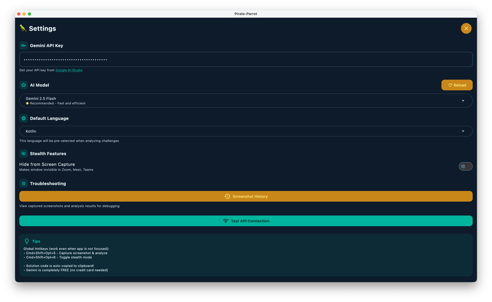
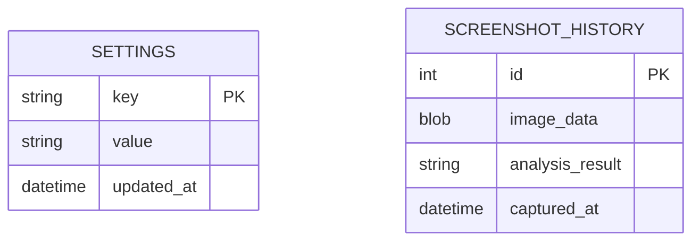

# Configuration

Configure Pirate-Parrot to work with your preferences.

## Required: Gemini API Key

The app uses Google's Gemini AI for analysis. You need a free API key.

### Get Your API Key

1. Go to [Google AI Studio](https://aistudio.google.com)
2. Sign in with your Google account
3. Click **"Create API Key"**
4. Copy the generated key

### Add Key to Pirate-Parrot

1. Open Pirate-Parrot
2. Click the **⚙️ Settings** icon
3. Paste your API key in the **"Gemini API Key"** field
4. The key is automatically saved

> **Security:** Your API key is stored locally in an encrypted database. It never leaves your device except when making API calls to Google.

---

## Optional Settings

### AI Model Selection

Choose the Gemini model based on your needs:

| Model | Best For | Speed |
|-------|----------|-------|
| `gemini-2.5-flash` | Most tasks (default) | ⚡ Fast |
| `gemini-2.5-pro` | Complex problems | 🐢 Slower |

### Default Programming Language

Set your preferred language for code solutions:

- Kotlin
- Java
- Python
- JavaScript
- TypeScript
- Go
- Rust
- C++
- C#
- Swift

### Stealth Mode

**Enabled by default.** When active, the app window is invisible to:

- Screen sharing (Zoom, Teams, Meet)
- Screen recording software
- Screenshots from other apps

Toggle via:
- Settings → "Hide from Screen Capture"
- Hotkey: <kbd>Cmd</kbd>+<kbd>Shift</kbd>+<kbd>Opt</kbd>+<kbd>B</kbd> (macOS)

---

## Settings Storage

All settings are persisted in a local SQLite database:

**Location:**
- macOS: `~/Library/Application Support/pirate-parrot/`
- Windows: `%APPDATA%/pirate-parrot/`
- Linux: `~/.config/pirate-parrot/`

---

## Configuration Checklist

- [ ] Gemini API Key configured
- [ ] Preferred AI model selected
- [ ] Default programming language set
- [ ] Stealth mode preference set
- [ ] Permissions granted (macOS)

Once configured, proceed to [Quick Start](/getting-started/quickstart.md) to learn how to use the app!
