# Installation

Choose your preferred installation method based on your needs.

## Option 1: Pre-built Packages (Recommended)

Download the latest release for your platform:

| Platform | Format | Download |
|----------|--------|----------|
| macOS | `.dmg` | [Download](https://github.com/ericomonteiro/pirate-parrot-ai/releases) |
| Windows | `.msi` | [Download](https://github.com/ericomonteiro/pirate-parrot-ai/releases) |
| Linux | `.deb` | [Download](https://github.com/ericomonteiro/pirate-parrot-ai/releases) |

### macOS Installation

1. Download the `.dmg` file
2. Open the DMG and drag Pirate-Parrot to Applications
3. On first launch, right-click and select "Open" to bypass Gatekeeper

### Windows Installation

1. Download the `.msi` installer
2. Run the installer and follow the prompts
3. If Windows Defender flags it, click "More info" → "Run anyway"

### Linux Installation

```bash
sudo dpkg -i pirate-parrot_1.0.0_amd64.deb
```

---

## Option 2: Build from Source

### Prerequisites

- **JDK 21** or later
- **Git**

### Clone and Run

```bash
# Clone the repository
git clone https://github.com/ericomonteiro/pirate-parrot-ai.git
cd pirate-parrot-ai

# Run in development mode
./gradlew :composeApp:run
```

### Build Distribution Package

<!-- tabs:start -->

#### **macOS**

```bash
./gradlew :composeApp:packageDmg
```

Output: `composeApp/build/compose/binaries/main/dmg/`

#### **Windows**

```bash
gradlew.bat :composeApp:packageMsi
```

> **Note:** Requires [WiX Toolset](https://wixtoolset.org/)

Output: `composeApp/build/compose/binaries/main/msi/`

#### **Linux**

```bash
./gradlew :composeApp:packageDeb
```

Output: `composeApp/build/compose/binaries/main/deb/`

<!-- tabs:end -->

### Cross-Platform JAR

Build a portable JAR that runs on any platform with Java 21:

```bash
./gradlew :composeApp:packageUberJarForCurrentOS
```

Run with:

```bash
java -jar composeApp/build/compose/jars/pirate-parrot-*.jar
```

---

## Platform Permissions

### macOS

Grant these permissions in **System Preferences → Security & Privacy → Privacy**:

| Permission | Purpose |
|------------|---------|
| **Accessibility** | Global hotkeys |
| **Screen Recording** | Screenshot capture |

```mermaid
flowchart TD
    A[Launch App] --> B{Permissions Granted?}
    B -->|No| C[System Preferences]
    C --> D[Security & Privacy]
    D --> E[Privacy Tab]
    E --> F[Add Pirate-Parrot]
    F --> B
    B -->|Yes| G[✅ Ready to Use]
    
    style G fill:#00BFA6,color:#0D1B2A
```



### Windows

- Run as **Administrator** if hotkeys don't work
- Allow through **Windows Defender** on first run

### Linux

- May require `libxkbcommon` for global hotkeys
- Run with `sudo` if hotkeys don't register

---

## Verify Installation

After installation, launch Pirate-Parrot and verify:

1. ✅ Application window appears
2. ✅ Home screen loads with 🦜 logo
3. ✅ Settings icon is clickable

If everything works, proceed to [Configuration](/getting-started/configuration.md).
