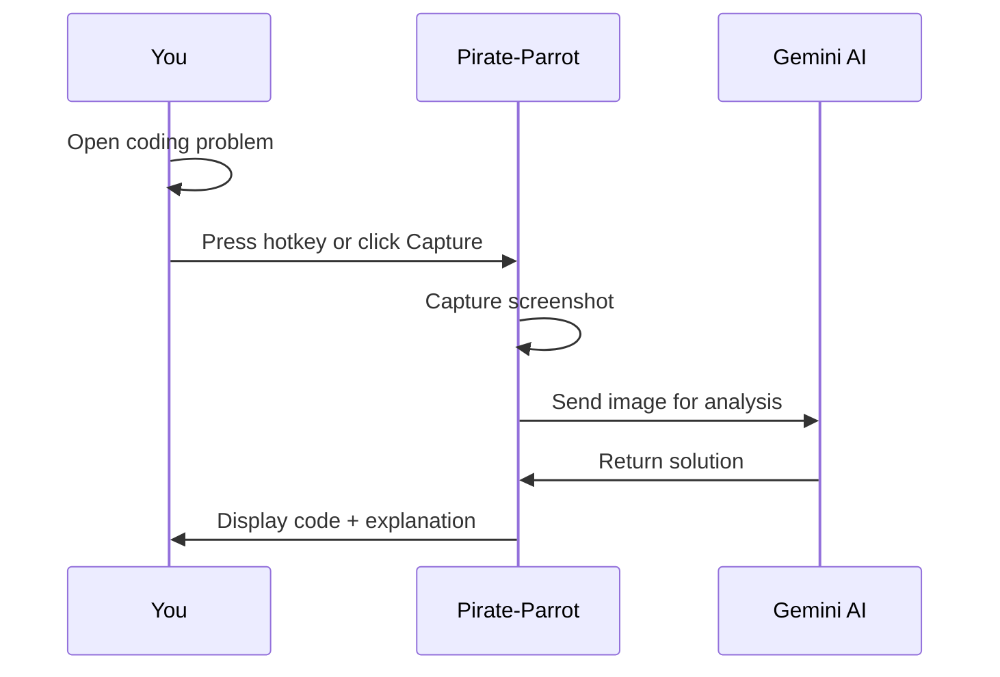
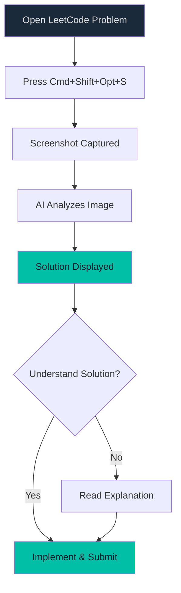

# Quick Start

Learn the basics of Pirate-Parrot in 5 minutes.

## The Workflow



## Step 1: Choose Your Mode

From the Home screen, select your task:

| Mode | Icon | Use Case |
|------|------|----------|
| **Code Challenge** | 💻 | LeetCode, HackerRank, etc. |
| **Certification** | 📜 | AWS certification exams |
| **Generic Exam** | 📝 | ENEM, Vestibular, Concursos |

## Step 2: Prepare Your Screen

1. Open the problem/question in your browser or app
2. Make sure the **entire question is visible**
3. Position Pirate-Parrot where you can see both

> **Tip:** Pirate-Parrot stays "always on top" by default, so it won't get hidden behind other windows.

## Step 3: Capture & Analyze

### Using Hotkeys (Recommended)

| Platform | Screenshot | Toggle Stealth |
|----------|------------|----------------|
| macOS | <kbd>Cmd</kbd>+<kbd>Shift</kbd>+<kbd>Opt</kbd>+<kbd>S</kbd> | <kbd>Cmd</kbd>+<kbd>Shift</kbd>+<kbd>Opt</kbd>+<kbd>B</kbd> |
| Windows | <kbd>Ctrl</kbd>+<kbd>Shift</kbd>+<kbd>Alt</kbd>+<kbd>S</kbd> | <kbd>Ctrl</kbd>+<kbd>Shift</kbd>+<kbd>Alt</kbd>+<kbd>B</kbd> |

### Using the UI

Click the **"Capture Screenshot"** button in any analysis screen.

## Step 4: Review Results

### Code Challenge Results

```
┌─────────────────────────────────────┐
│ 📝 Explanation                      │
│ Brief description of the approach   │
├─────────────────────────────────────┤
│ 💻 Code Solution                    │
│ def solution():                     │
│     # Complete code here            │
│     return result                   │
├─────────────────────────────────────┤
│ ⏱️ Time: O(n)  |  💾 Space: O(1)   │
└─────────────────────────────────────┘
```

### Certification Results

```
┌─────────────────────────────────────┐
│ ✅ Correct Answer: B                │
├─────────────────────────────────────┤
│ 📖 Explanation                      │
│ Why this answer is correct...       │
├─────────────────────────────────────┤
│ ❌ Why Others Are Wrong             │
│ A: Because...                       │
│ C: Because...                       │
├─────────────────────────────────────┤
│ 🔗 Related Services: S3, Lambda     │
└─────────────────────────────────────┘
```

---

## Example Workflow



---

## Pro Tips

### 🎯 For Best Results

1. **Clear screenshots** - Ensure text is readable
2. **Complete questions** - Include all options/constraints
3. **One question at a time** - For complex problems

### ⚡ Speed Tips

- Use hotkeys instead of clicking
- Keep Pirate-Parrot on a second monitor
- Enable stealth mode before screen sharing

### 🔒 Privacy Tips

- Stealth mode hides the app from recordings
- Toggle stealth with <kbd>Cmd</kbd>+<kbd>Shift</kbd>+<kbd>Opt</kbd>+<kbd>B</kbd>
- Check the indicator in the toolbar

---

## Troubleshooting

| Issue | Solution |
|-------|----------|
| Hotkeys don't work | Grant Accessibility permission (macOS) |
| Screenshot is black | Grant Screen Recording permission |
| "API key not configured" | Add key in Settings |
| Slow response | Try `gemini-2.5-flash` model |

---

## Next Steps

- Learn about [Code Challenge Mode](/features/code-challenge.md)
- Explore [Certification Mode](/features/certification.md)
- Understand the [Architecture](/architecture/)
